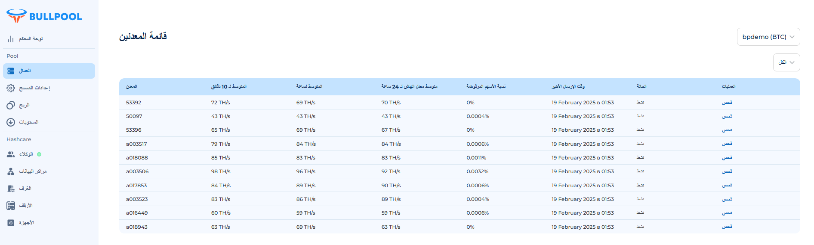

# العمال

في نظام Bullpool، تُعرف الأجهزة باسم العمال (Worker). هؤلاء هم العناصر الأساسية الذين:

• يمثلون جهازًا واحدًا أو عدة أجهزة متصلة بحوض التعدين.

• يقومون بتنفيذ مهام تعدين العملات الرقمية.

## ماذا يفعل العامل (Worker)؟

كل عامل:

• 🖥️ ينفذ المهام الحسابية لحل الكتل.

• 📊 يراقب الأداء - يقوم الحوض بتسجيل نتائج عمله.

• ⚡ يعمل على تحسين كفاءة تعدين العملات الرقمية.

## قائمة المُعدّنين

<figure><figcaption>
تعرض الصفحة بيانات المُعدّنين المجمعة من الحوض. تظهر في الصفحة جميع العمال المتصلين بنفس الحوض. لاختيار حوض آخر، استخدم القائمة المنسدلة.
</figcaption></figure>

<figure><figcaption>
قائمة الأحواض المتاحة
</figcaption></figure>

## **جدول العمال: المعلومات الأساسية والمعايير**

يقدم جدول العمال معلومات كاملة عن كل جهاز متصل بالحوض. فيما يلي الأعمدة الرئيسية ومعانيها:

### **1. المُعدّن**

معرف العامل (ID Worker) داخل الحوض، مما يسمح بتحديد الجهاز وعلاقته بالحوض بسرعة.

### **2. متوسط معدل الهاش (Hashrate)**

يعرض معدل الهاش للجهاز خلال فترات مختلفة:

• متوسط آخر 10 دقائق - أداء الجهاز خلال فترة قصيرة.

• متوسط آخر ساعة - القيمة المتوسطة خلال الساعة الماضية.

• متوسط آخر 24 ساعة - مؤشر استقرار الجهاز على المدى الطويل.

تساعد هذه البيانات في تحليل كفاءة التعدين واكتشاف أي انحرافات عن الأداء المتوقع.

### **3. نسبة الأسهم المرفوضة (Reject Rate)**

يوضح هذا المؤشر النسبة المئوية للأسهم (الحلول) التي أرسلها الجهاز ولكن لم يتم قبولها من قبل الحوض.

• يُعبر عنها كنسبة مئوية.

• تشير إلى كفاءة نقل البيانات بين الجهاز والحوض.

• قد تشير النسبة العالية إلى مشكلات في الشبكة أو إعدادات الجهاز.

### **4. وقت آخر إرسال**

يوضح الوقت الذي تم فيه إرسال آخر حصة إلى الحوض.

• يتم تحديث البيانات كل 5 دقائق.

### **5. الحالة**

الحالة الحالية للجهاز:

• نشط - الجهاز يعمل والبيانات تصل إلى الحوض.

• غير نشط - لا تصل البيانات إلى الحوض (قد يكون هناك مشكلة في الاتصال أو في الجهاز نفسه).

### **6. العمليات**

زر تفاعلي يتيح لك:

• عرض رسم بياني لتغير معدل الهاش للعامل.

• تحليل نسبة الرفض (الأسهم المرفوضة).

<figure><figcaption></figcaption></figure>
