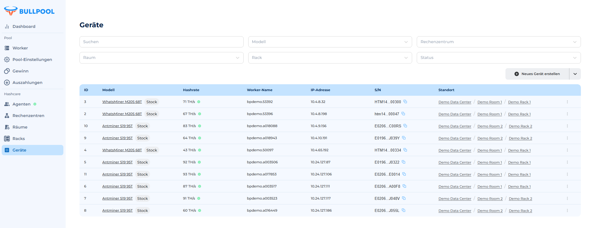

# 📈 Seite „Gewinn“

Auf der Seite „Gewinn“ findest du Informationen zur täglichen Rentabilität zum Zeitpunkt des Tagesabschlusses für alle deine Pools.

• 🔽 **Pool-Auswahl:** Wechsle zwischen Pools über das Dropdown-Menü in der oberen rechten Ecke.

<figure><figcaption></figcaption></figure>

## **💰 Wie wird der Gesamtgewinn berechnet?**

\
Der Gesamtgewinn wird nach folgender Formel berechnet:

(TH \* BTC-Wert pro TH \* Anzahl der Tage)

🗓️ **Anzahl der Tage:**

• Woche – 7 Tage.

• Monat – 30 Tage.

Diese Informationen helfen dir, die Effizienz jedes Pools schnell einzuschätzen und die Rentabilität zu planen.

_Tipp:_ Füge ein Diagramm oder eine Tabelle hinzu, um den Gewinn für jeden Pool über den ausgewählten Zeitraum visuell darzustellen.

## 📊 Tabelle zur Gewinnberechnung

\
Die Tabelle zeigt die täglichen Erträge und enthält die wichtigsten Parameter:

• 📅 **Tag** – das Datum, für das der Gewinn berechnet wird.

• ⚡ **Hashrate** – die gesamte Hashrate aller Geräte, die mit dem ausgewählten Pool verbunden sind.

• 💰 **Gesamtgewinn** – der endgültige Gewinn nach Abzug der Gebühren.

• 📈 **Gewinn pro TH/s** – der durchschnittliche Ertrag pro Terahash pro Sekunde (TH/s), der an diesem Tag erzielt wurde.

• 🔄 **PPLNS** – der Tagesgewinn, berechnet nach der Methode „Pay Per Last N Shares“ (Einnahmenverteilung basierend auf den zuletzt eingereichten Shares).

• 💵 **PPS** – der Tagesgewinn, berechnet nach der Methode „Pay Per Share“ (feste Zahlung für jeden akzeptierten Share).

• 🏆 **SOLO** – der Tagesgewinn beim Mining im SOLO-Modus (Belohnung für das eigenständige Lösen eines Blocks).

Diese Tabelle hilft dir, die Effizienz der einzelnen Vergütungsmethoden zu analysieren und deine Ressourcen optimal zu verwalten.
