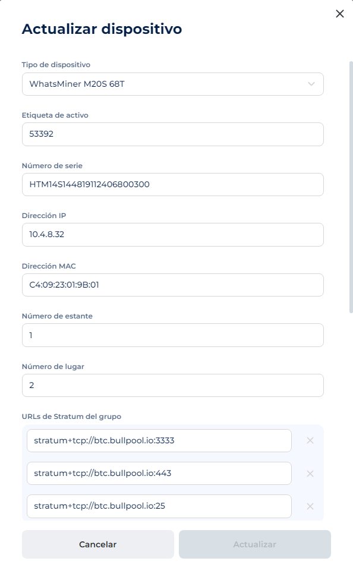

# Dispositivos

Para la recopilación de datos por un agente externo, es necesario crear dispositivos con parámetros definidos. Los dispositivos se vinculan a un rack, y sin esta asociación, no es posible crearlos. Por defecto, no hay dispositivos.

### **Tabla "Dispositivos"**

• **Buscar**: ingresar caracteres para filtrar por etiqueta de activo.

• **Centro de datos, sala, rack**: filtros para seleccionar dispositivos en zonas específicas.

• **Crear nuevo dispositivo**: botón para la creación de un dispositivo.

### **Campos de la tabla**

• **ID del dispositivo**: número único del sistema.

• **Modelo**: determinado por el agente o ingresado manualmente; se muestra el firmware.

• **Tasa de hash**: rendimiento actual (TH/s):

🟢 Círculo verde: tasa de hash mayor a 0.

🔴 Círculo rojo: tasa de hash igual a 0 o no determinada.

• **Nombre del trabajador**: nombre del pool y del dispositivo (definido por el agente o manualmente).

• **Dirección IP**: detectada automáticamente o ingresada manualmente.

• **S/N**: número de serie, determinado por el agente o ingresado manualmente.

• **Ubicación**: Centro de datos / Sala / Rack (enlaces a las entidades).

• **Edición**: botón para configurar los parámetros.

<figure><figcaption></figcaption></figure>

## **Creación de un dispositivo a través del formulario**

1\. Ir al menú **Dispositivos**.

2\. Hacer clic en el botón **Crear nuevo dispositivo**.

3\. En la ventana emergente, ingresar los siguientes datos:

• **Tipo de dispositivo**: modelo (menú desplegable con función de búsqueda). _Campo obligatorio._

• **Etiqueta de activo**: nombre único del dispositivo en el sistema Hashcare. _Campo obligatorio._

• **Número de serie**: _Campo obligatorio._

• **Dirección IP**: debe cumplir con el formato: ^(25\[0-5]|2\[0-4]\[0-9]|1\[0-9]{2}|\[1-9]?\[0-9]).(25\[0-5]|2\[0-4]\[0-9]|1\[0-9]{2}|\[1-9]?\[0-9]).(25\[0-5]|2\[0-4]\[0-9]|1\[0-9]{2}|\[1-9]?\[0-9]).(25\[0-5]|2\[0-4]\[0-9]|1\[0-9]{2}|\[1-9]?\[0-9])$. _Campo obligatorio._

• **Dirección MAC**: debe cumplir con el formato: ^\[a-fA-F0-9]:\[a-fA-F0-9]{2}{5}$.

• **Número de estante**: número del estante libre en función del rack.

* No puede ser igual a 0. _Error: "Debe ser mayor o igual a 1"._
* No puede ser mayor que el número total de estantes en el rack. _Error: "error.codes.rack\_exceed\_max\_size"._
* Debe ser un número. _Error: "Formato incorrecto"._

• **Número de lugar**: número del espacio libre en el estante.

* No puede ser igual a 0. _Error: "Debe ser mayor o igual a 1"._
* No puede ser mayor que el número total de lugares en el estante.
* Debe ser un número. _Error: "Formato incorrecto"._

• **URLs de Stratum del grupo**: hasta 3 direcciones. _Campo opcional._

• **Nombre del trabajador del grupo**: nombre del dispositivo en el pool. _Campo obligatorio._

• **Nombre del pool**: nombre del pool. _Campo obligatorio._

• **Rack**: selección de un rack existente. _Campo obligatorio._

• **Tipo de firmware**: _Campo obligatorio._

4\. Hacer clic en **Crear**.

<figure><figcaption></figcaption></figure>

## **Importación de dispositivos en lista** 

1\. Ir al menú **Dispositivos**.

2\. Seleccionar la opción **Importar dispositivos (.csv)** en el menú desplegable.

3\. Seleccionar el archivo .csv en el disco duro.

4\. Si la carga es exitosa, aparecerá el mensaje "Archivo cargado con éxito".

<figure><figcaption></figcaption></figure>

**Ejemplo de tabla CSV**

<figure><figcaption></figcaption></figure>

## **Edición de dispositivo**  

1\. Hacer clic en el botón (tres puntos) junto al dispositivo deseado.  

2\. Seleccionar la opción **Actualizar**.  

_**Parámetros disponibles para la edición:**_  

• **Tipo de dispositivo** — modelo. Campo desplegable con función de búsqueda. _Obligatorio._  

• **Etiqueta de activo** — nombre único del dispositivo en el sistema Hashcare. _Obligatorio._  

• **Número de serie** — _Obligatorio._  

• **Dirección IP** — debe cumplir con el formato:  
^(25\[0-5]|2\[0-4]\[0-9]|1\[0-9]{2}|\[1-9]?\[0-9]).(25\[0-5]|2\[0-4]\[0-9]|1\[0-9]{2}|\[1-9]?\[0-9]).(25\[0-5]|2\[0-4]\[0-9]|1\[0-9]{2}|\[1-9]?\[0-9]).(25\[0-5]|2\[0-4]\[0-9]|1\[0-9]{2}|\[1-9]?\[0-9])$.  
_Obligatorio._  

• **Dirección MAC** — debe cumplir con el formato: ^\[a-fA-F0-9]:\[a-fA-F0-9]{2}{5}$. _Obligatorio._  

• **Número de estante** — número del estante libre en el rack seleccionado.  

  * No puede ser igual a 0. _Error: “Debe ser mayor o igual a 1”._  
  * No puede ser mayor que el número total de estantes en el rack. _Error: “error.codes.rack\_exceed\_max\_size”._  
  * Debe ser un número. _Error: “Formato incorrecto”._  

• **Número de lugar** — número del espacio libre en el estante.  

  * No puede ser igual a 0. _Error: “Debe ser mayor o igual a 1”._  
  * No puede ser mayor que el número total de lugares en el estante. _Error: “Formato incorrecto”._  
  * Debe ser un número. _Obligatorio._  

• **URLs de Stratum del grupo** — direcciones de Stratum. Se pueden agregar de 1 a 3 direcciones. _Opcional._  

• **Nombre del trabajador del grupo** — nombre del dispositivo en el pool. _Obligatorio._  

• **Nombre del pool** — nombre del pool. _Obligatorio._  

• **Rack** — selección de un rack existente. _Obligatorio._  

• **Tipo de firmware** — _Obligatorio._  

• **Modificar cantidad de estantes** (Altura) — debe ser mayor o igual a 1 y menor o igual a 10.  

• **Modificar cantidad de lugares en estantes** (Ancho) — debe ser mayor o igual a 1 y menor o igual a 10.  

• **Modificar la sala** a la que estará vinculado el rack.  

<figure><figcaption></figcaption></figure>

3\. Hacer clic en **Actualizar** para guardar los cambios.  

## **Edición de dispositivos a través de archivo CSV**   

Existe la posibilidad de editar varios dispositivos a la vez mediante un archivo CSV. Para ello, se debe cargar un archivo CSV con la lista de dispositivos ya creados.  

1\. El **identificador principal** será la **Dirección MAC**:  
   - Si la dirección MAC del dispositivo en el CSV coincide con la de un dispositivo en Hashcare, los demás datos se actualizan según el archivo CSV.  
   - Si la dirección MAC no está registrada en el sistema Hashcare, se creará un nuevo dispositivo con los parámetros definidos en el CSV.  

## **Eliminación de un dispositivo**  

1\. Hacer clic en el botón (tres puntos) junto al dispositivo deseado.  

2\. Seleccionar la opción **Eliminar**.  

3\. En la ventana emergente, hacer clic en **Confirmar**.  

<figure><figcaption></figcaption></figure>

## **Detalles del dispositivo**  

• **Modelo**  

Se detecta automáticamente por el agente interno o se configura manualmente en la configuración del dispositivo. Incluye el hashrate nominal de fábrica.  

• **Dirección IP**  

Se detecta automáticamente por el agente interno al escanear la red o se configura manualmente en la configuración del dispositivo.  

• **Firmware**  

Se detecta automáticamente por el agente interno al escanear el dispositivo o se configura manualmente en la configuración del dispositivo.  

• **Número de serie (S/N)**  

Se detecta automáticamente por el agente interno al escanear el dispositivo o se configura manualmente en la configuración del dispositivo.  

### **Potencia**  

• **Potencia nominal**  

Valor estático preestablecido para cada modelo de dispositivo.  

* **W/TH** - Relación de potencia nominal en función del hashrate nominal del modelo.  

• **Hashrate nominal**  

Valor del hashrate de fábrica obtenido por el agente interno del ASIC.  

### **Información adicional**  

• **Nombre del trabajador**  

Compuesto por el nombre del pool y el nombre del dispositivo en el pool. Se detecta automáticamente por el agente interno o se configura manualmente en la configuración del dispositivo.  

• **Dirección MAC**  

Se detecta automáticamente por el agente interno al escanear el dispositivo o se configura manualmente en la configuración del dispositivo.  

<figure><figcaption></figcaption></figure>

### **Indicadores:**  

**• Ingreso estimado (PPS | FPPS):**  

* **PPS** (Pay Per Share): pago fijo por shares.  
* **FPPS** (Full Pay Per Share): incluye ingresos por tarifas, superior a PPS.  

**• Ingreso del pool:**  

Ingreso real recibido del pool durante el período seleccionado.  

_Configurar pool: «Configuración de pools» → Crear pool._  

**• Costos de electricidad:**  

Basado en la potencia del dispositivo y la tarifa:\\  

(Consumo de energía (W) × 24) ÷ 1000 × Tarifa\\  

**• Beneficio:**  

{Ingreso FPPS} - {Electricidad}  

### **Gráfico de tasa de hash**  

• **Asic Hashrate** — tasa de hash actual reportada por el dispositivo.  

• **Nominal Hashrate** — tasa de hash nominal del fabricante.  

### **Gráfico de tasa de hash de placas**  

Muestra el rendimiento de las placas individuales del minero ASIC.  

• Cada placa se representa, por ejemplo, como SM 0, SM 1, SM 2.  

• Ayuda a identificar fallos que reducen el hashrate total.  

### **Temperatura del dispositivo**  

• **Temperatura de placas y chips**: muestra el calentamiento de los componentes internos del dispositivo.  

• **Temperatura del aire (entrada/salida):**  

* **In** — temperatura del aire frío de entrada.  
* **Out** — temperatura del aire caliente de salida.  

### **Gráfico de velocidad de ventiladores**  

Muestra las RPM de los ventiladores de enfriamiento.  

* **In** — ventiladores de entrada de aire.  
* **Out** — ventiladores de salida de aire.  

### **Gráfico de consumo de energía**  

* **Asic Power** — consumo actual reportado por el dispositivo.  
* **Nominal Power** — consumo nominal del fabricante.  

<figure><figcaption></figcaption></figure>

