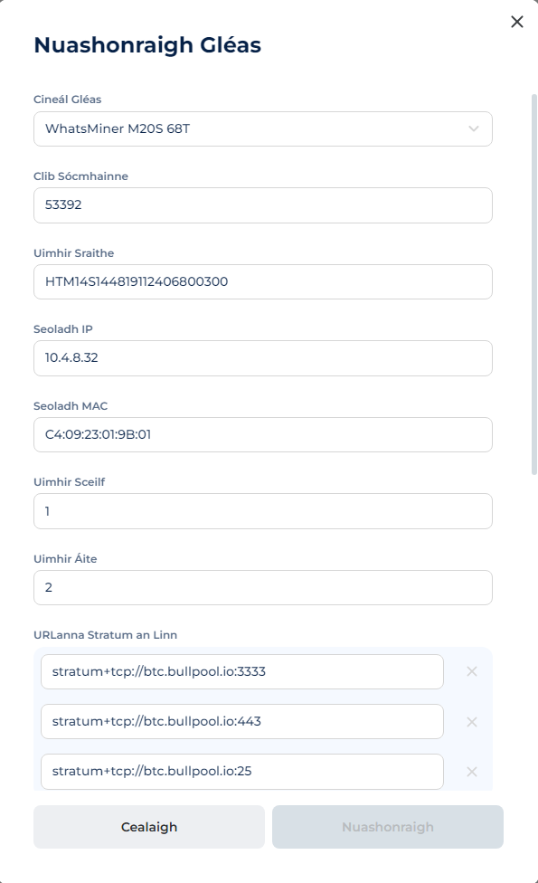

# Racaí

Is eintiteas é raca atá ceangailte le seomra amháin agus ina bhfuil líon áirithe suíomhanna do ghléasanna. Taispeántar sonraí na ngléasanna laistigh de.

• Is féidir líon neamhtheoranta racaí a chruthú i seomra amháin.

• Cruthaítear raca amháin de réir réamhshocraithe agus é ceangailte leis an seomra cruthaithe.

## **Tábla “Racaí”**

• Cuardach — cuardach de réir ainm.

• Ionad Sonraí — rogha racaí in ionad sonraí ar leith.

• Seomraí — rogha racaí i seomra áirithe.

• Cruthaigh Raca Nua — cnaipe chun raca nua a chruthú.

## Réimsí na Tábla:

• ID — aitheantas sa bhunachar sonraí.

• Ainm — ainm an raca.

• Ionad Sonraí — ainm an ionaid sonraí.

• Seomra — seomra a bhfuil an raca ceangailte leis.

• Nuashonrú — cumraíocht na bparaiméadar.

<figure><figcaption></figcaption></figure>

## **Cruthú Raca**

1\. Téigh go dtí an roghchlár **Racaí**.

2\. Cliceáil ar an gcnaipe **Cruthaigh Raca Nua**.

3\. Sa fhuinneog a osclaítear:

* Iontráil ainm sa réimse **Ainm**.
* Sonraigh líon na seilfeanna (**Airde**) ó 1 go 10.
* Sonraigh líon na suíomhanna in aghaidh na seilfe (**Leithead**) ó 1 go 10.
* Roghnaigh an seomra ón roghchlár anuas.

4\. Cliceáil ar an gcnaipe **Cruthaigh**.

<figure><figcaption></figcaption></figure>

## **Nuashonrú Raca**

1\. Cliceáil ar an gcnaipe _trí phonc_ in aice leis an raca atá uait.

2\. Roghnaigh **Nuashonraigh**.

3\. Déan na hathruithe seo a leanas:

* Ainm nua.
* Líon na seilfeanna (**Airde**) ó 1 go 10.
* Líon na suíomhanna in aghaidh na seilfe (**Leithead**) ó 1 go 10.
* Seomra a mbeidh an raca ceangailte leis.

4\. Cliceáil **Nuashonraigh**.

<figure><figcaption></figcaption></figure>

## **🗑️ Scriosadh Raca** 

1. Cliceáil ar an gcnaipe _trí phonc_ in aice leis an raca atá uait.
2. Roghnaigh **Scrios**.
3. Sa fhuinneog a osclaítear, cliceáil ar an gcnaipe **Deimhnigh**.

<figure><figcaption></figcaption></figure>

## **Nascleanúint go Leathanach an Raca**

* Sa roghchlár **Racaí**, cliceáil ar **Ainm** an raca atá uait.

## **Содержимое страницы стеллажа**

### **Детали:**

• Размер: ширина × высота (например, 10×10).

• Количество мест: общее число (ширина × высота).

• Количество устройств:

* Всего — неактивные + онлайн.
* Онлайн — устройства передают данные.

<figure><figcaption></figcaption></figure>

### **Графики:**

**• Хэшрейт:**

* Asic Hashrate — переданный устройством.
* Nominal Hashrate — заявленный производителем.

**• Потребление:**

* Asic Power — переданное устройством.
* Nominal Power — заявленное производителем.

**• Устройства:**

* Active Asic — работающие устройства.
* Total Asic — все устройства, включая нерабочие.

<figure><figcaption></figcaption></figure>

### **Карта стеллажа**

Отображает 2D-схему с заданным количеством мест и размещёнными устройствами.

• В каждой ячейке указаны:

* Действительный хэшрейт.
* Максимальная температура чипов.

• Особенности отображения:

* Если хэшрейт или температура = 0 или превышают норму, шрифт становится красным.
* Для просмотра текущих проблем можно переключить отображаемую характеристику в правом верхнем углу.

<figure><figcaption></figcaption></figure>

### **Список устройств на стеллаже**

Перечисляет устройства, привязанные к стеллажу.

• Таблица включает:

* ID устройства — уникальный идентификатор, заданный системой.
* Модель — определяется агентом или задаётся вручную; отображается прошивка.
* Хэшрейт — текущий показатель устройства:

&#x20;     🟢 Хэшрейт > 0

&#x20;     🔴 Хэшрейт = 0 или не определён

* Имя воркера — состоит из имени пула и устройства, определяется агентом или вручную.
* IP-адрес — автоматически определяется агентом или задаётся вручную.

<figure><figcaption></figcaption></figure>
