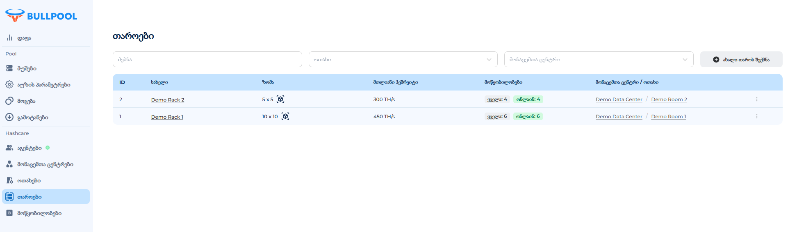

# თაროები

სტელაჟი — ეს არის ერთ ოთახთან დაკავშირებული ერთეული, რომელიც შეიცავს გარკვეულ რაოდენობის ადგილს მოწყობილობებისთვის. ის აჩვენებს მხოლოდ იმ მოწყობილობების მონაცემებს, რომლებიც მასში განთავსებულია.

• შესაძლებელია ერთ ოთახში შეუზღუდავი რაოდენობის სტელაჟების შექმნა.

• ნაგულისხმევად შეიქმნება ერთი სტელაჟი, რომელიც მიბმულია შექმნილ ოთახთან.

## **ცხრილი „სტელაჟები“**

• ძიება — ძიება სახელით.

• მონაცემთა ცენტრი — კონკრეტულ მონაცემთა ცენტრში არსებული სტელაჟების არჩევა.

• ოთახი — სტელაჟების არჩევა კონკრეტულ ოთახში.

• ახალი სტელაჟის დამატება — ღილაკი ახალი სტელაჟის შესაქმნელად.

## ცხრილის ველები:

• ID — ბაზაში უნიკალური იდენტიფიკატორი.

• სახელი — სტელაჟის სახელი.

• მონაცემთა ცენტრი — რომელ მონაცემთა ცენტრს ეკუთვნის.

• ოთახი — რომელ ოთახთან არის მიბმული.

• რედაქტირება — პარამეტრების კონფიგურაცია.

<figure><figcaption></figcaption></figure>

## **სტელაჟის შექმნა**

1\. გადადით **სტელაჟების** მენიუში.

2\. დააჭირეთ **ახალი სტელაჟის დამატება**.

3\. გახსნილ ფანჯარაში:

* შეიყვანეთ **სახელი**.
* მიუთითეთ თაროების რაოდენობა (სიმაღლე) 1-დან 10-მდე.
* მიუთითეთ ადგილების რაოდენობა თაროზე (სიგანე) 1-დან 10-მდე.
* აირჩიეთ ოთახი ჩამოსაშლელი სიიდან.

4\. დააჭირეთ **შექმნა**.

<figure><figcaption></figcaption></figure>

## **სტელაჟის რედაქტირება**

1\. დააჭირეთ _სამ წერტილს_ სასურველი სტელაჟის გვერდით.

2\. აირჩიეთ **რედაქტირება**.

3\. შეიტანეთ ცვლილებები:

* ახალი სახელი.
* თაროების რაოდენობა (სიმაღლე) 1-დან 10-მდე.
* ადგილების რაოდენობა თაროზე (სიგანე) 1-დან 10-მდე.
* ოთახი, რომელთანაც იქნება მიბმული.

4\. დააჭირეთ **განახლება**.

<figure><figcaption></figcaption></figure>

## **სტელაჟის წაშლა:** 

1. დააჭირეთ _სამ წერტილს_ სასურველი სტელაჟის გვერდით.
2. აირჩიეთ **წაშლა**.
3. გახსნილ ფანჯარაში დააჭირეთ **დადასტურება**.

<figure><figcaption></figcaption></figure>

## **სტელაჟის გვერდზე გადასვლა**

* **სტელაჟები** მენიუში დააჭირეთ სასურველი სტელაჟის **სახელს**.

## **სტელაჟის გვერდის შიგთავსი**

### **დეტალები:**

• ზომა: სიგანე × სიმაღლე (მაგალითად, 10×10).

• ადგილების რაოდენობა: საერთო რაოდენობა (სიგანე × სიმაღლე).

• მოწყობილობების რაოდენობა:

* **სულ** — გათიშული + ჩართული.
* **ჩართული** — მოწყობილობები, რომლებიც აგზავნიან მონაცემებს.

<figure><figcaption></figcaption></figure>

### **გრაფიკები:**

**• ჰეშრეიტი:**

* **Asic Hashrate** — გადაცემული მოწყობილობის მიერ.
* **Nominal Hashrate** — მწარმოებლის მიერ მითითებული.

**• ენერგომოხმარება:**

* **Asic Power** — მოწყობილობის მიერ გადაცემული.
* **Nominal Power** — მწარმოებლის მიერ მითითებული.

**• მოწყობილობები:**

* **Active Asic** — ჩართული მოწყობილობები.
* **Total Asic** — ყველა მოწყობილობა, მათ შორის გათიშული.

<figure><figcaption></figcaption></figure>

### **სტელაჟის რუკა**

აჩვენებს 2D სქემას დაყენებული რაოდენობის ადგილებით და განთავსებული მოწყობილობებით.

• თითოეულ უჯრაში მითითებულია:

* მიმდინარე ჰეშრეიტი.
* ჩიპების მაქსიმალური ტემპერატურა.

• ჩვენების თავისებურებები:

* თუ ჰეშრეიტი ან ტემპერატურა = 0 ან აჭარბებს ნორმას, შრიფტი ხდება წითელი.
* მიმდინარე პრობლემების სანახავად შეგიძლიათ შეცვალოთ ნაჩვენები მახასიათებელი ზედა მარჯვენა კუთხეში.

<figure><figcaption></figcaption></figure>

### **სტელაჟზე განთავსებული მოწყობილობების სია**

შეიცავს იმ მოწყობილობებს, რომლებიც მიბმულია სტელაჟზე.

• ცხრილი მოიცავს:

* **მოწყობილობის ID** — სისტემის მიერ მინიჭებული უნიკალური იდენტიფიკატორი.
* **მოდელი** — აგენტი განსაზღვრავს ან მითითებულია ხელით; ასევე ნაჩვენებია ფირმვეარი.
* **ჰეშრეიტი** — მიმდინარე მაჩვენებელი:

&#x20;     🟢 ჰეშრეიტი > 0

&#x20;     🔴 ჰეშრეიტი = 0 ან გაურკვეველი

* **ვორკერის სახელი** — შედგება პულისა და მოწყობილობის სახელისგან, რომელიც განსაზღვრულია აგენტის ან ხელით.
* **IP მისამართი** — ავტომატურად განსაზღვრული აგენტის მიერ ან მითითებული ხელით.

<figure><figcaption></figcaption></figure>
