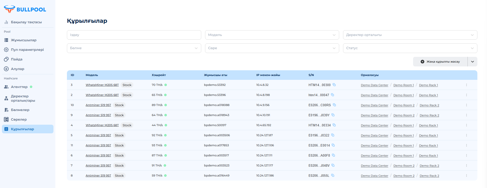

# Бастау үшін

<figure><figcaption>
Жеке кабинетке алғаш кіргенде бірде-бір пул қосылмаған
</figcaption></figure>

<figure><figcaption></figcaption></figure>

## 🚀 Пул жасау

\
1\. **"Пул параметрлері"** мәзіріне өтіңіз.

2\. **"Пул жасау"** батырмасын басыңыз.

3\. Ашылған терезеде келесі параметрлерді толтырыңыз:

• **Пул атауы** (міндетті түрде, бос орынсыз, үлгі: ^\[a-zA-Z0-9]+$).

• Атау автоматты түрде "bp" префиксімен толықтырылады.

• ❗ _Егер атау бос емес болса_, қате пайда болады: **"Пул атауы резервтелген"**.

• **Түсініктеме** (міндетті емес өріс).

• **Валюта** (әдепкі бойынша BTC).

4\. **"Жасау"** батырмасын басыңыз.

### Шектеулер:

• ❗ _Пул жасалғаннан кейін оны өңдеу мүмкін емес._

• ❗ _Бір клиентке максимум 5 пул жасауға рұқсат етілген._ Егер шек асса, қате пайда болады: **"Сіз көбірек пул жасай алмайсыз"**.

## 📋 Пулдар тізімі

Барлық жасалған пулдар келесі кестеде көрсетіледі:

• **Пул атауы** – жасалған кезде көрсетілген атау.

• **Түсініктеме** – толтырылған болса көрсетіледі.

• **Валюта** – әдепкі бойынша BTC.

## ⚙️ Құрылғыны пулға қосу

\
Құрылғыны қосу үшін келесі әрекеттерді орындаңыз:

1\. **"Пул параметрлері"** мәзіріне өтіңіз.

2\. Қажетті пулдың жанында **"Құрылғыны қосу"** батырмасын басыңыз.

3\. Ашылған терезеде көшіріп алыңыз:

• 3 **URL** мекенжайын және оларды құрылғы параметрлеріне енгізіңіз.

• **Жұмысшы** атауын, ол келесі бөліктерден тұрады:

* **Пул атауы** – Bullpool жүйесіндегі пулдың атауы.
* **Құрылғы ID** – сіз орнататын идентификатор (бірегей немесе бірнеше құрылғы үшін бірдей болуы мүмкін).

❕ _Егер ID бірнеше құрылғы үшін бірдей болса, жүйе осы ID бар барлық құрылғылардың жалпы көрсеткіштерін көрсетеді._

<figure><figcaption></figcaption></figure>

## 💰 Қаражатты шығару параметрлері

\
1\. **"Пул параметрлері"** мәзіріне өтіңіз.

2\. Қажетті пулдың жанында **"Алу"** батырмасын басыңыз.

3\. Ашылған терезеде қаражат аударылатын **әмиян нөмірін** енгізіңіз.

4\. **"Сақтау"** батырмасын басыңыз.

\
**Автоматты түрде қаражат шығару:**

* Минималды сома **0.001 BTC** жеткенде, күн сайын **12:00 UTC** дейін қаражат көрсетілген әмиянға жіберіледі.
* Егер минималды шығару сомасын өзгерту қажет болса, **қолдау қызметіне хабарласыңыз**.

\
Осыдан кейін сіз **"Pool"** бөліміндегі жеке кабинет функцияларымен таныса аласыз.
