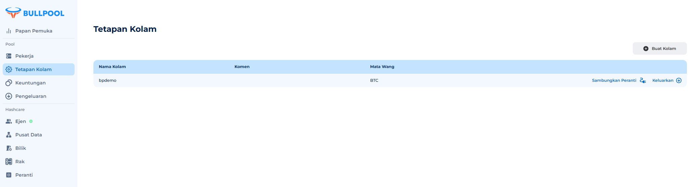

# Pekerja

Dalam sistem Bullpool, peranti dikenali sebagai **Pekerja** (Worker). Ini adalah elemen utama yang:

• Mewakili satu atau lebih peranti yang disambungkan ke kolam perlombongan.

• Menjalankan tugas perlombongan mata wang kripto.

## Apakah fungsi Worker?

Setiap Worker:

• 🖥️ Menjalankan pengiraan untuk menyelesaikan blok.

• 📊 Mengesan prestasi — kolam merekod hasil kerjanya.

• ⚡ Mengoptimumkan keberkesanan perlombongan mata wang kripto.

## Senarai Pelombong

<figure><figcaption></figcaption></figure>

<figure><figcaption>
Data yang dikumpul dari kolam ditunjukkan pada halaman **Senarai Pelombong**. Halaman ini memaparkan pekerja dalam satu kolam perlombongan. Untuk memilih kolam lain, buka menu pilihan kolam yang telah dibuat.
</figcaption></figure>

<figure><figcaption></figcaption></figure>

<figure><figcaption>
Senarai kolam yang telah dibuat.
</figcaption></figure>

## **Jadual Pekerja: Maklumat Utama dan Parameter**

Jadual pekerja mengandungi maklumat penuh mengenai setiap peranti yang disambungkan ke kolam. Berikut adalah lajur utama dan nilainya:

### **1. Pelombong**

ID pekerja (ID Worker) dalam kolam. Ia membolehkan anda mengenal pasti peranti dengan cepat dan hubungannya dengan kolam.

### **2. Purata Kadar Hash**

Kadar hash peranti dalam pelbagai tempoh masa:

• **Purata 10 minit** — prestasi dalam jangka masa pendek.

• **Purata satu jam** — nilai purata dalam tempoh sejam terakhir.

• **Purata 24 jam** — penunjuk kestabilan jangka panjang peranti.

Data ini membantu menganalisis keberkesanan perlombongan dan mengenal pasti sebarang penyimpangan.

### **3. Kadar Saham Ditolak (Reject Rate)**

Menunjukkan peratusan saham (share) yang dihantar oleh peranti tetapi ditolak oleh kolam.

• Dinyatakan dalam peratus.

• Menunjukkan keberkesanan penghantaran data antara peranti dan kolam.

• Kadar penolakan yang tinggi boleh menunjukkan masalah rangkaian atau tetapan peranti.

### **4. Masa Penyerahan Terakhir**

Masa penghantaran saham terakhir ke kolam.

• Data dikemas kini setiap 5 minit.

### **5. Status**

Status semasa peranti:

• **Aktif** — peranti berfungsi dan data dihantar ke kolam.

• **Tidak Aktif** — data dari peranti tidak diterima oleh kolam (mungkin terdapat masalah sambungan atau peranti).

### **6. Operasi**

Butang interaktif yang membolehkan anda:

• Melihat carta perubahan kadar hash pekerja.

• Menganalisis kadar penolakan saham.

<figure><figcaption></figcaption></figure>
