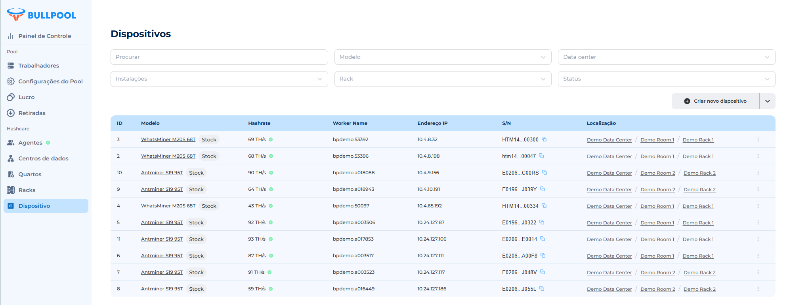

# Dispositivo

Para coletar dados por um agente externo, é necessário criar dispositivos com parâmetros definidos. Os dispositivos são vinculados a um rack, sendo impossível a criação sem essa vinculação. Por padrão, os dispositivos estão ausentes.

### **Tabela Dispositivos**

• Procurar — entrada de caracteres para filtragem por tag do ativo.

• Centro de Dados, Instalações, Rack — filtros para seleção de dispositivos em zonas específicas.

• Criar novo dispositivo — botão para criação.

### **Campos da tabela**

• ID do dispositivo — número único no sistema.

• Modelo — determinado pelo agente ou definido manualmente; inclui firmware.

• Hashrate — desempenho atual (Th/s):

🟢 Círculo verde — hashrate maior que 0.

🔴 Círculo vermelho — hashrate igual a 0 ou não definido.

• Worker Name — nome do pool e do dispositivo (determinado pelo agente ou manualmente).

• Endereço IP — determinado automaticamente ou definido manualmente.

• S/N — número de série, determinado pelo agente ou manualmente.

• Localização — Centro de Dados / Quarto / Rack (links para os objetos).

• Alteração — botão de configuração de parâmetros.

<figure><figcaption></figcaption></figure>

## **Criação de dispositivo via formulário**

1\. Acesse o menu **Dispositivos**.

2\. Clique no botão **Criar novo dispositivo**.

3\. Na janela aberta, insira os seguintes dados:

• **Tipo de dispositivo** — modelo (menu suspenso com função de pesquisa). _Obrigatório._

• **Etiqueta de ativo** — nome único do dispositivo no sistema Hashcare. _Obrigatório._

• **Número de série** — _Obrigatório._

• **Endereço IP** — deve seguir o padrão: ^(25\[0-5]|2\[0-4]\[0-9]|1\[0-9]{2}|\[1-9]?\[0-9]).(25\[0-5]|2\[0-4]\[0-9]|1\[0-9]{2}|\[1-9]?\[0-9]).(25\[0-5]|2\[0-4]\[0-9]|1\[0-9]{2}|\[1-9]?\[0-9]).(25\[0-5]|2\[0-4]\[0-9]|1\[0-9]{2}|\[1-9]?\[0-9])$. _Obrigatório._

• **Endereço MAC** — deve seguir o padrão: ^\[a-fA-F0-9]:\[a-fA-F0-9]{2}{5}$.

• **Número da prateleira** — número da prateleira disponível no rack.

* Não pode ser igual a 0. _Erro: “Deve ser maior ou igual a 1”._
* Não pode ser maior que o número máximo de prateleiras do rack. _Erro: “error.codes.rack\_exceed\_max\_size”._
* Deve ser apenas numérico. _Erro: “Formato incorreto”._

• **Número do local** — número do espaço disponível na prateleira.

* Não pode ser igual a 0. _Erro: “Deve ser maior ou igual a 1”._
* Não pode ser maior que o número de espaços na prateleira.
* Deve ser apenas numérico. _Erro: “Formato incorreto”._

• **Pool Stratum URLs** — até 3 endereços. _Opcional._

• **Nome do trabalhador do pool** — nome do dispositivo no pool. _Obrigatório._

• **Nome da conta do pool** — nome do pool. _Obrigatório._

• **Rack** — seleção entre racks existentes. _Obrigatório._

• **Tipo de firmware** — _Obrigatório._

4\. Clique em **Criar**.

<figure><figcaption></figcaption></figure>

## **Importação de dispositivos via lista** 

1. Acesse o menu **Dispositivos**.
2. Escolha a opção no menu suspenso **Importar dispositivos (.csv)**.
3. Selecione um arquivo .csv no disco rígido.
4. Após o upload bem-sucedido, a mensagem “Arquivo carregado com sucesso” será exibida.

<figure><figcaption></figcaption></figure>

<figure><figcaption></figcaption></figure>

**Exemplo de tabela CSV**

<figure><figcaption></figcaption></figure>

## **Edição de dispositivo**

1\. Clique no botão (três pontos) ao lado do dispositivo desejado.

2\. Selecione a opção **Alteração**.

_**Parâmetros disponíveis para edição:**_

• **Tipo de dispositivo** — modelo. O campo funciona como um menu suspenso com função de pesquisa. _Obrigatório._

• **Tag do ativo** — nome único do dispositivo no sistema Hashcare. _Obrigatório._

• **Número de série** — _Obrigatório._

• **Endereço IP** — deve seguir o padrão válido. _Obrigatório._

• **Endereço MAC** — deve seguir o padrão válido. _Obrigatório._

• **Número da prateleira** — número da prateleira disponível conforme o rack selecionado.

* Não pode ser igual a 0. _Erro: “Deve ser maior ou igual a 1”._
* Não pode ser maior que o número máximo de prateleiras no rack. _Erro: “error.codes.rack\_exceed\_max\_size”._
* Deve ser apenas numérico. _Erro: “Formato incorreto”._

• **Número do espaço** — número do espaço disponível na prateleira.

* Não pode ser igual a 0. _Erro: “Deve ser maior ou igual a 1”._
* Não pode ser maior que o número de espaços na prateleira. _Erro: “Formato incorreto”._
* Deve ser apenas numérico. _Obrigatório._

• **Pool Stratum URLs** — endereços Stratum. Pode conter de 1 a 3 endereços. _Opcional._

• **Nome do trabalhador do pool** — nome do dispositivo no pool. _Obrigatório._

• **Nome do pool** — nome do pool. _Obrigatório._

• **Rack** — seleção entre racks existentes. _Obrigatório._

• **Tipo de firmware** — _Obrigatório._

• **Alterar número de prateleiras** (Altura) — deve ser maior ou igual a 1 e menor ou igual a 10.

• **Alterar número de espaços na prateleira** (Largura) — deve ser maior ou igual a 1 e menor ou igual a 10.

• **Alterar o quarto** ao qual o rack está vinculado.

<figure><figcaption></figcaption></figure>

3\. Clique em **Atualizar** para salvar as alterações.

## **Edição de dispositivos via arquivo CSV** 

É possível editar mais de um dispositivo ao mesmo tempo via arquivo CSV. Para isso, carregue um CSV com a lista de dispositivos já criados.

1. O **Endereço MAC** é o identificador principal. Se um dispositivo no CSV possuir o mesmo **Endereço MAC**, os dados serão atualizados.
2. Se o **Endereço MAC** não existir no sistema Hashcare, um novo dispositivo será criado com os parâmetros do CSV.

## **Exclusão de dispositivo**

1. Clique no botão (_três pontos_) ao lado do dispositivo desejado.
2. Selecione a opção **Excluir**.
3. Na janela aberta, clique em **Confirmar**.

<figure><figcaption></figcaption></figure>

## **Detalhes do Dispositivo:**

• **Modelo**

Determinado automaticamente pelo agente interno ou definido manualmente nas configurações do dispositivo. Inclui o hashrate de fábrica.

• **Endereço IP**

Determinado automaticamente pelo agente interno ao consultar a rede ou definido manualmente nas configurações do dispositivo.

• **Firmware**

Determinado automaticamente pelo agente interno ao consultar o dispositivo ou definido manualmente nas configurações do dispositivo.

• **Número de Série (S/N)**

Determinado automaticamente pelo agente interno ao consultar o dispositivo ou definido manualmente nas configurações do dispositivo.

### **Potência**

• **Potência Nominal**

Valor estático definido para cada modelo de dispositivo.

* W/TH - valor relativo calculado como a relação entre o consumo nominal e o hashrate nominal do modelo.

• **Hashrate Nominal**

Valor do hashrate de fábrica, obtido pelo agente interno do ASIC.

### **Informações Adicionais**

• **Nome do Trabalhador**

Consiste no nome do pool e no nome do dispositivo no pool. Determinado automaticamente pelo agente interno ou definido manualmente nas configurações do dispositivo.

• **Endereço MAC**

Determinado automaticamente pelo agente interno ao consultar o dispositivo ou definido manualmente nas configurações do dispositivo.

<figure><figcaption></figcaption></figure>

### **Métricas:**

**• Receita Estimada (PPS | FPPS):**

* PPS (Pay Per Share): pagamento fixo por shares.
* FPPS (Full Pay Per Share): inclui receita de taxas, superior ao PPS.

**• Receita do Pool:**

Receita real do pool para o período selecionado.

_Configuração do pool: "Configuração de Pools" → Criar Pool._

**• Custos com Eletricidade:**

Baseado na potência do dispositivo e na tarifa:\\

(Potência consumida (W) × 24) ÷ 1000 × Tarifa\\

**• Lucro:**

{Receita FPPS} - {Eletricidade}

### **Gráfico de Hashrate**

• **Asic Hashrate** — hashrate atual transmitido pelo dispositivo.

• **Nominal Hashrate** — hashrate declarado pelo fabricante.

### **Gráfico de Hashrate das Placas**

Mostra o desempenho das placas individuais do ASIC minerador.

• Cada placa é identificada, por exemplo, como SM 0, SM 1, SM 2.

• Ajuda a identificar falhas que reduzem o hashrate geral.

### **Temperatura do Dispositivo**

• Temperatura das placas (boards) e chips (chip, PCB): exibe o aquecimento dos componentes individuais do dispositivo.

• Temperatura do ar (in/out):

* **In** — temperatura do ar frio de entrada.
* **Out** — temperatura do ar quente de saída.

### **Gráfico da Velocidade dos Ventiladores**

Mostra as rotações por minuto (RPM) dos ventiladores de resfriamento.

* **In** — ventiladores na entrada do fluxo de ar.
* **Out** — ventiladores na saída.

### **Gráfico de Consumo de Energia**

* **Asic Power** — consumo atual transmitido pelo dispositivo.
* **Nominal Power** — consumo declarado pelo fabricante.

<figure><figcaption></figcaption></figure>
