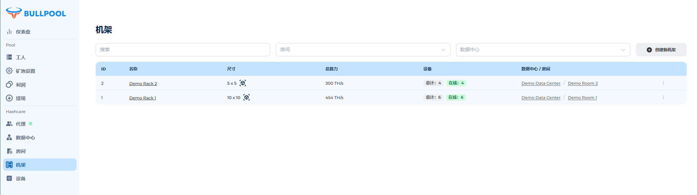

# 机架

机架是绑定到一个房间的实体，其中包含一定数量的设备位置。仅显示机架内设备的数据。

• 在一个房间内可以创建无限数量的机架。

• 默认情况下，会创建一个绑定到新建房间的机架。

## **机架表格**

• 搜索 — 按名称搜索。

• 数据中心 — 选择特定数据中心中的机架。

• 房间 — 选择房间中的机架。

• 创建新机架 — 按钮用于创建机架。

## 表格字段:

• ID — 数据库中的唯一标识符。

• 名称 — 机架的名称。

• 数据中心 — 机架所属的数据中心。

• 房间 — 机架绑定的房间。

• 编辑 — 配置机架参数。

<figure><figcaption></figcaption></figure>

## **创建机架**

1. 进入 **机架** 菜单。

2. 点击 **创建新机架** 按钮。

3. 在弹出的窗口中:

* 在 **名称** 字段中输入机架名称。
* 指定设备层数 (高度)，范围 1 到 10。
* 指定每层设备位置数 (宽度)，范围 1 到 10。
* 从下拉列表中选择房间。

4. 点击 **创建**。

<figure><figcaption></figcaption></figure>

## **编辑机架**

1. 点击目标机架旁的 _三点按钮_。

2. 选择 **编辑** 选项。

3. 进行修改:

* 新名称。
* 设备层数 (高度) 1 到 10。
* 每层设备位置数 (宽度) 1 到 10。
* 重新绑定机架的房间。

4. 点击 **更新**。

<figure><figcaption></figcaption></figure>

## **删除机架** 

1. 点击目标机架旁的 _三点按钮_。

2. 选择 **删除** 选项。

3. 在弹出的窗口中点击 **确认** 按钮以执行操作。

<figure><figcaption></figcaption></figure>

## **进入机架页面**

* 在 **机架** 菜单中，点击目标机架的 **名称** 进入其页面。

## **机架页面内容**

### **详情:**

• 尺寸: 宽度 × 高度 (如 10×10)。

• 设备位置数: 总数 (宽度 × 高度)。

• 设备数量:

* 总数 — 离线 + 在线。
* 在线 — 设备正在传输数据。

<figure><figcaption></figcaption></figure>

### **图表:**

**• 哈希率:**

* Asic Hashrate — 设备上传的实际数据。
* Nominal Hashrate — 制造商标称值。

**• 功耗:**

* Asic Power — 设备上传的实际数据。
* Nominal Power — 制造商标称值。

**• 设备:**

* Active Asic — 运行中的设备。
* Total Asic — 所有设备，包括离线的。

<figure><figcaption></figcaption></figure>

### **机架地图**

以 2D 形式显示机架上的设备分布。

• 每个单元格显示:

* 实际哈希率。
* 芯片的最高温度。

• 显示特性:

* 如果哈希率或温度 = 0 或超过正常值，则字体变为红色。
* 右上角可以切换显示不同参数，以查看设备状态。

<figure><figcaption></figcaption></figure>

### **机架设备列表**

列出当前机架中的所有设备。

• 表格字段:

* 设备 ID — 系统分配的唯一标识符。
* 设备型号 — 由代理程序自动识别或手动设置，并显示固件信息。
* 哈希率 — 设备当前的计算能力:

&#x20;     🟢 哈希率 > 0

&#x20;     🔴 哈希率 = 0 或未检测到

* 工作名 — 由代理程序自动分配或手动设置，包括矿池名称和设备名称。
* IP 地址 — 由代理程序自动分配或手动设置。

<figure><figcaption></figcaption></figure>
